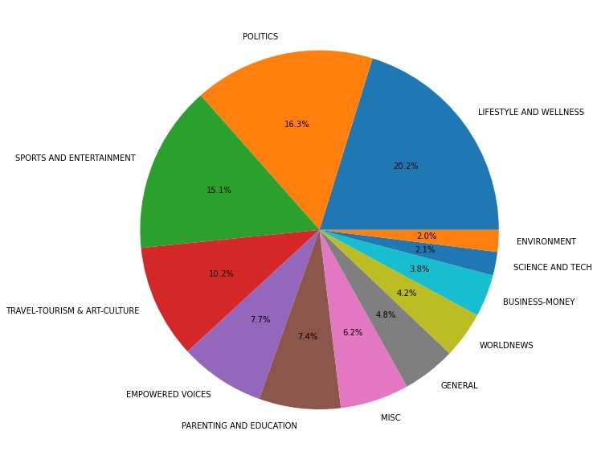
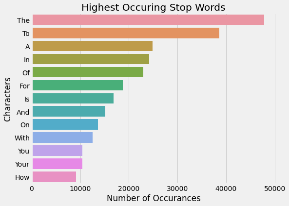
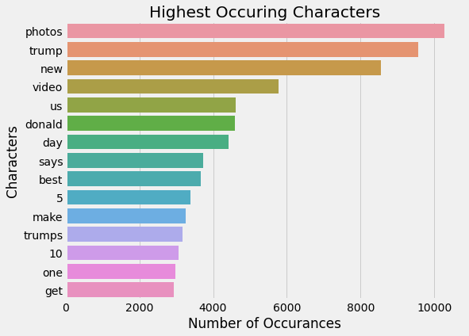

# Natural Language Processing: News Article Categorization

---
**Authors**: Chandler O'Neal, Jordan Johnson, Kyle Vosen
---

## Overview

The focus of this project was to create a machine learning model that could receive descriptions of unknown news articles from huffington post and categorize them. The original data contained 5 features, the target variable (the category of the article), and 200,853 records (News Articles); these were then reduced to one feature, the concatenated headline and the description, the target variable, and 200,853 records. This model could be used to organize articles that have not yet been categorized in a more resourceful manner. 


---

## Business Problem

Huffington Post had found it necessary to add a model to their toolbelt that would help them to organize yet to be categorized articles. F-1 score was the metric used for this project as it was not necessary to weigh false negatives (incorrectly predicting the returned categorization to be inaccurate) or false positives (incorrectly predicting the returned categorization to be accurate) more heavily. 


---

## Data 

This project used the News Category Dataset from Rishabh Misra which had originally been web scraped from The Huffington Post. The data, post cleaning, contained 1 feature, the combination of the headline and description features, with 200,853 records. 


---

### Content

* `Headline`: Title of the article.

* `Short_description`: Short description of the article.

* `NOTE`: Both headline and short description were concatenated (combined) prior to the modeling process.


---

### Predictor Value

* `Category`: Each article's classification.


---

## Methods Used 

**Data Preparation**
 
* `Removing Stop Words`: Words unnecissary towards predicting the category (ex: the, in, a, on). 


* `Tokenizing Words`: Sepparating all headline and desciptions into individual words to then combine them as a list of words.

* `Lemmatizing Words`: Removing affixes from words (reducing words to their root by removing any letters attached to them).

* `Vectorization:` Transformed lemmatized words into numerical values in order to predict the articles.

* `Modeling:` Used a Logistic Regression to determine the model predictions for an F1 score.

* `Pickeling:` Used pickeling to save our model to use for deployment.


---

## Results 

A visual to display the imbalances within each category, meaning some categories have far more news articles than others (ex: Lifestyle and Wellness holds 20.2% of articles whereas Environment holds 2.0%). 




---

The stop words, as seen below, are highly common throughout the headlines and descriptions, however; they prove to be unhelpful when training the model to recognize commonalities between the categories, headlines, and descriptions.




---

The words below have proven to be helpful towards training the model to recognize certain patters between the categories - reason being that they are far more unique than the stop words above. 




---

## Conclusions

* The model was able to predict the category of each article description with 62 percent accuracy with a slight overfit on the training data - 66 percent F-1 score. 

* While the model accuracy was not substantially high, it would prove to be a meaningful model in predicting news article categories for Huffington Post.


---

## Next Steps 

* To add a new feature that would account for the percentage of the different parts of speech in each description to improve model accuracy.

* To reduce model bias and overfitting by using a Grid Search CV to establish the best use hyperparameters.

* To host the final logistic regression model on a website domain. 


--- 

## For More Information

Please review our full analysis in [our Jupyter Notebook](../notebooks/notebook_nlp.pdf) or our [presentation](./project_4_presentation.pdf).

For any additional questions, please contact **Chandler O'Neal & jchandleroneal@gmail.com, Jordan Johnson & jrjohnso@bsc.edu, Kyle Vosen & kylevosen1999@gmail.com**


---

## Repository Structure


```
├──data                                <- The tables used for this project 
├──images                              <- The images used 
├──src                                 <- The table links used 
├──README.md                           <- The README for project summary
├── notebooks 
│   ├──exploratory
│   └── final_notebook.ipynb           <- The Location of the processing notebooks           
├── project_4_presentation.pdf         <- PDF version of project presentation
│
├── notebooks 
│   ├──exploratory
│   └──notebook_nlp.pdf.ipynb
└── images                             <- All photos used for README.md
    └──...
```

---

## Acknowledgements
[Kaggle](https://www.kaggle.com/rmisra/news-category-dataset) The kaggle source that the data has been taken from.

[Kaggle Creator](https://www.kaggle.com/rmisra/news-category-dataset#:~:text=rishabhmisra.github.io/publications) The creator of the data source on kaggle.

[Huffington Post](https://www.huffpost.com/) The original source of the data.